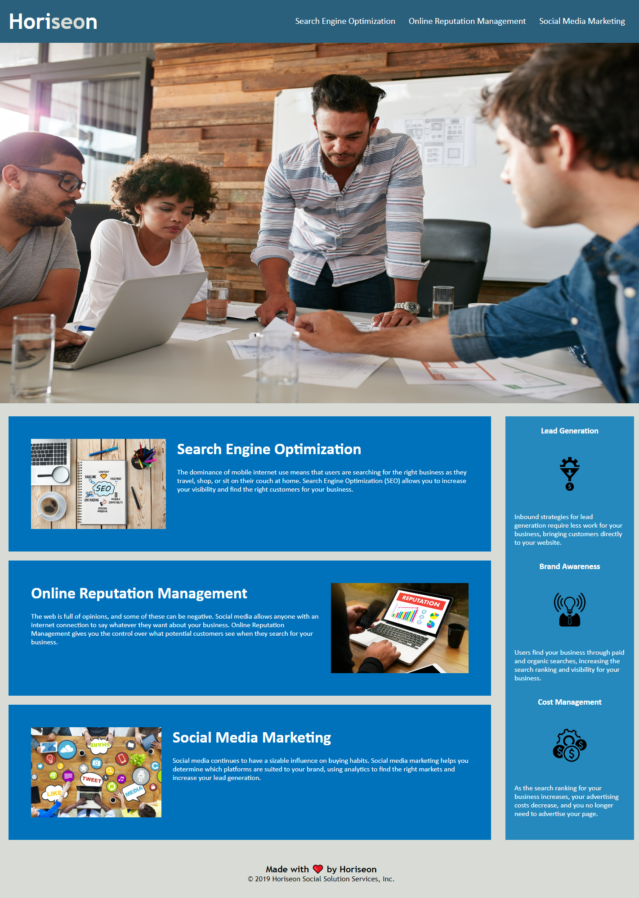

# Challenge: Module 1

## Description

Given code for a search engine optimization company, Horiseon, update their website html and css to add accessibility features and descriptive tags for web content and images.

## Tasks accomplished

<ul>
    <li>Added descriptive title to browser tab.</li>
    <li>Added semantic html tags for the body, header, images, main section, aside and footer of the webpage.</li>
    <li>Ensure links on nav bar link to each section of the main page content.</li>
    <li>Added alt text to all images to add accessibility descriptions to images</li>
    <li>Sized aside section of webpage to be the same height as the main section</li>
    <li>Consolidated similar CSS styles to one style where applicable and reordered CSS styles to match order in the .html file.</li>
</ul>

## Website Link

Link to deployed website is [Horiseon: Search Engine Optimization](https://larsonrj.github.io/module1-challenge/)

## Website Preview

## Future Improvements

<ul>
    <li>Update sizing of main section and aside to be formatted on smaller screen types</li>
    <li> Use flexbox to evenly distribute items for example the items in the aside section overflow the height on a narrower screen.
